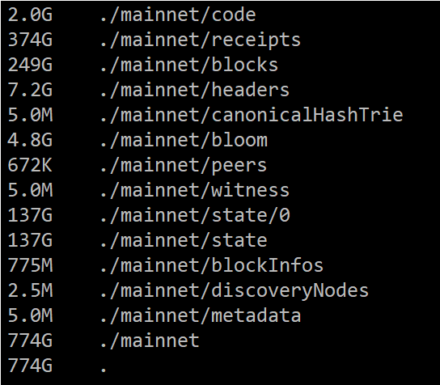

# ETH2 &lt;-&gt; Nethermind

## Cliente Nethermind como  endpoint ETH1


You should always consider being able to switch to Infura or another provider as a backup for safety \(or run two nodes yourself\)👈 



For a more comprehensive step-by-step guide, you should look into one of these awesome guides -&gt; [https://someresat.medium.com/](https://someresat.medium.com/). Below you will find instructions on how to run Nethermind node -&gt; **Step 6 — Set up an Ethereum \(Eth1\) Node**


### Obtener y ejecutar Nethermind

* [x] Descargar el cliente Nethermind

Puede obtenerlo desde Github Releases o desde nuestra página de Descargas:



* [x] descomprimir el paquete
* [x] ejecute el nodo Nethermind \ (use `Nethermind.Launcher` o cambie `configs/mainnet.cfg` y ejecuta `Nethermind.Runner --config mainnet`\)


use the Linux **screen** utility to keep your node working in the background


```text
screen -S nethermind
./Nethermind.Launcher
```



Enable **JSON RPC** service so that your ETH2 Beacon node will be able to communicate




Configure EthStats para su nodo si es necesario:


Debería ver el nodo comenzando:



**Tip:** Ctrl + A + D to leave the **screen**


### Ejecutando Nethermind como un servicio systemd



### Monitoreo del estado del nodo Nethermind

Siga esta guía para configurar la configuración local basada en Prometheus/Grafana y monitorear las estadísticas más importantes de su nodo allí.






The Block Number will be **0** for the **unsynced** node


Para verificar si su nodo está sincronizado, puede ejecutar la llamada `eth_syncing` verificar su resultado

```text
curl -X POST --data '{"jsonrpc":"2.0","method":"eth_syncing","params":[],"id":1}' localhost:8545
```

Si el resultado muestra `false`  significa que su nodo está **synced**

```text
{"jsonrpc":"2.0","result":false,"id":1}
```

Consulte la siguiente guía para obtener un monitoreo aún mejor del estado de los nodos:



