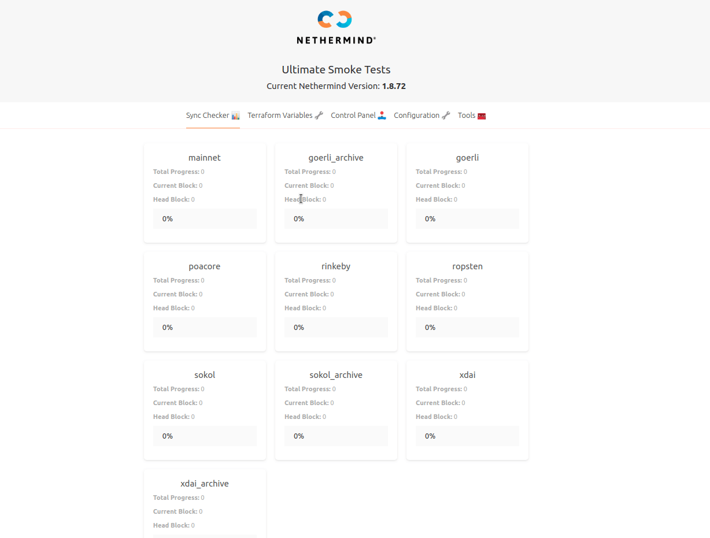
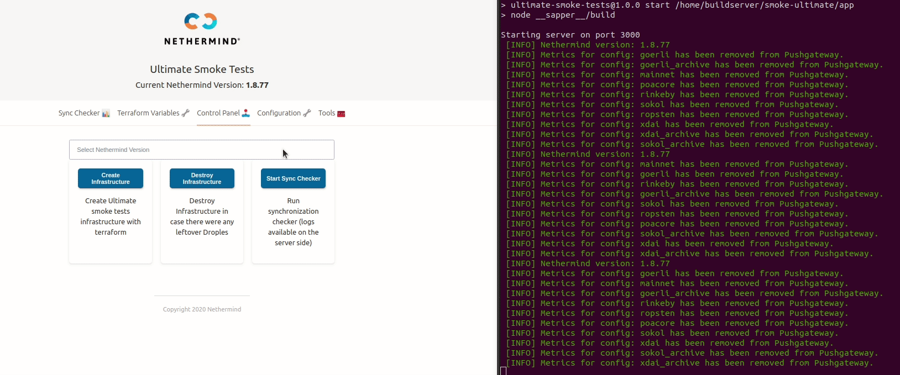

# Smoke Testing Example

## Intro

A software release for production often includes a series of tests and build steps throughout the CI/CD process. In this article, I will show you how to get the potential of different monitoring/infrastructure building tools combined and use the smoke tests for your projects. Please note that this article is a simple overview and will not go into specific details, but rather will allow you to pick a tech stack of your choice that meets your project's needs.

Tools and technologies used in this project:

* [Terraform](https://www.terraform.io/) \(to design the smoke tests infrastructure\)
* [Terragrunt](https://terragrunt.gruntwork.io/) \(to quickly deploy every module with a single command\)
* [Node.js](https://nodejs.org/en/) \(to build backend scripts for smoke tests management\)
* Bash \(to build simple scripts for infrastructure management\)
* [Svelte/Sapper](https://sapper.svelte.dev/) \(to build a handy UI and keep everything in place\)
* [Portainer ](https://www.portainer.io/)\(to manage dockers from a single point\)
* [Pushgateway/Prometheus](https://prometheus.io/)/[Grafana](https://grafana.com/) \(to consume the node's metrics and monitor them\)

In _Nethermind_, one of the core tests to verify the correct operation of our application is the synchronization test with the Ethereum Mainnet and many other [networks](https://docs.nethermind.io/nethermind/ethereum-client/networks) currently supported by _Nethermind_, such as Rinkeby, Ropsten, xDai, Sokol, etc. The synchronization of an Ethereum node is generally required if you wish to have access to the current state of the network. In my example, I will be testing the default synchronization method which is the`fast sync`, more on that can be found [here](https://docs.nethermind.io/nethermind/ethereum-client/sync-modes#fast-sync).

## Components

To achieve this goal, we will use the creation of complete infrastructure using tools such as _terraform_ and its wrapper _terragrunt_. Each network will be tested separately on a separate virtual machine hosted on _DigitalOcean_ which provides a very easy to use API. We will also wrap everything into a simple UI that will allow us to manage and monitor the status of our smoke tests.

As a first step, we are going to create folders containing _terraform_ and _terragrunt_ files for each network. In your case, there might be some different configurations of your app which behavior you would like to test in a separate environment.

```text
module/
├── goerli
│   ├── main.tf
│   ├── terraform.tfvars
│   ├── terragrunt.hcl
│   └── variables.tf
├── goerli_archive
│   ├── main.tf
│   ├── terraform.tfvars
│   ├── terragrunt.hcl
│   └── variables.tf
├── mainnet
│   ├── main.tf
│   ├── terraform.tfvars
│   ├── terragrunt.hcl
│   └── variables.tf
├── poacore
│   ├── main.tf
│   ├── terraform.tfvars
│   ├── terragrunt.hcl
│   └── variables.tf
├── rinkeby
│   ├── main.tf
│   ├── terraform.tfvars
│   ├── terragrunt.hcl
│   └── variables.tf
├── ropsten
│   ├── main.tf
│   ├── terraform.tfvars
│   ├── terragrunt.hcl
│   └── variables.tf
├── sokol
│   ├── main.tf
│   ├── terraform.tfvars
│   ├── terragrunt.hcl
│   └── variables.tf
├── sokol_archive
│   ├── main.tf
│   ├── terraform.tfvars
│   ├── terragrunt.hcl
│   └── variables.tf
├── xdai
│   ├── main.tf
│   ├── terraform.tfvars
│   ├── terragrunt.hcl
│   └── variables.tf
└── xdai_archive
    ├── main.tf
    ├── terraform.tfvars
    ├── terragrunt.hcl
    └── variables.tf
```

In our [`main.tf`](https://gist.github.com/matilote/c1ec9955edc3c2140f6e52eb092376f8) files in each of the above folders we described [digitalocean\_droplet ](https://registry.terraform.io/providers/digitalocean/digitalocean/latest/docs/resources/droplet)resource which basically defines the `name, image, region, size`and connection details that will be used to connect and remotely execute commands on a virtual machine. We have also defined an output containing a droplets IP address upon creation, which will be used later to query over and verify synchronization status. Each folder will also consist of a [`terragrunt.hcl`](https://gist.github.com/matilote/18e09273b939d87235babd8e63f1d7eb), [`variables.tf`](https://gist.github.com/matilote/897bbf5ed7bf27e4f1b9dccfb0dbbb40) and `terraform.tfvars` files. To learn more about how to configure these files, check out the links below:

* [https://terragrunt.gruntwork.io/docs/getting-started/configuration/](https://terragrunt.gruntwork.io/docs/getting-started/configuration/)
* [https://www.terraform.io/docs/configuration-0-11/variables.html](https://www.terraform.io/docs/configuration-0-11/variables.html)

Once we have our terraform templates ready, we will need a script that will create the whole infrastructure for us so that we don't have to do it manually.

Firstly, we will need to set up `terraform.tfvars` files ready in each module. We can use the below script to achieve that automatically. You also have the ability to pass arguments to the script, which will then go over all modules and write data to file.

```bash
#!/bin/bash
cd module/

for D in *; do
    if [ -d "${D}" ]; then
        cd "${D}/"
        cat > terraform.tfvars <<EOF 
do_token = "$1"
hostname = "$2"
pvt_key = "$3"
ssh_fingerprint = "$4"
gateway = "$5"
EOF
        cd ..
    fi
done
```

Next, we can use the below script which also goes over each module \(Ethereum chains in our case\) and sets up a `TF_VAR_tag` a variable that defines the application version for which smoke tests will be running and then uses the power of _terragrunt_ to begin creating virtual machines with the app already configured and running.

```bash
#!/bin/bash

echo "Running smoke tests for tag $1"
# Run tests for each instance
cd module/
for D in *; do
    if [ -d "${D}" ]; then
        cd "${D}/"
        sed -i '3s/.*/    TF_VAR_tag = "'"$1"'"/' terragrunt.hcl
        cd ..
    fi
done

# Go back to the main dir
cd ..

# Apply to terraform modules
echo "Y" | terragrunt apply-all

echo "Infrastructure created"
```

If we wish to destroy the infrastructure we can use this bash script:

```bash
#!/bin/bash

echo "Finishing smoke tests for tag $1"

echo "Y" | terragrunt destroy-all

echo "Infrastructure destroyed"
```

## Ultimate smoke tests app

The project UI/backend was designed with _Svelte_/_Sapper_, very powerful Javascript frameworks for building web applications. Let's take a look at the UI.



The application itself is a simple single-page app that contains 5 routes. The front page is a simple dashboard that shows each network synchronization progress. We will see later on how it changes when smoke tests run.

In the second tab, we can set up terraform variables, it is a form that will trigger our previously described script which builds`terraform.tfvars`files. This needs to be run only once as this data does not change a lot.

The third tab is used to control our infrastructure as well as the current version that is being smoke tested and the core point of our application which is the button that runs the synchronization checker \(this one changes the state and updates the dashboard on the first page\).

The fourth tab is also a form that will save the data needed for clearing Pushgateway metrics, querying Etherscan API to fetch the current head block number \(refers to the current number block in a blockchain\) and path to the private key we used in `terraform.tfvars` , as we will be connecting to each VM to get the logs upon synchronization finish or on request.

Great! Now we have some overview of the contents of our smoke testing app. Let's go through it step by step and take a quick look behind the scenes as well.

Creating infrastructure can be triggered with a single button. It applies all the _terraform_ configurations we described above preparing the docker containers running _Nethermind_ nodes which are also configured to expose JSON RPC protocol and to push metrics to our Grafana dashboard so that we can control the performance in more details during the synchronization \(more on that can be found [here](https://docs.nethermind.io/nethermind/ethereum-client/metrics/setting-up-local-metrics-infrastracture)\).



Once we have our infrastructure running, we can start the synchronization checker and watch the progress of our smoke tests. It runs the _node.js_ script which queries over JSON RPC, [Etherscan](https://etherscan.io/) and [Blockscout](https://blockscout.com/poa/sokol/)


When it's done syncing, the tests will be finished for this network, logs will be fetched to the server on which the app is running, and its virtual machine will be destroyed. The appropriate status will be also displayed on the dashboard.


On the Tools tab, we may also run the [_Portainer_](https://www.portainer.io/) _\_docker instance. With \_Portainer_ we can manage docker containers on each machine, stop, restart, or even view the logs live and all of these in a single place.


Once all tests have passed, the whole infrastructure should be cleaned automatically, and we can then check the logs on the server-side if needed and look into the _Grafana_ dashboard to see how the application performed throughout the test.


If something goes wrong and one or more chains do not sync correctly, we can quickly download logs from the Tools tab for further investigation, destroy infrastructure from the Control Panel, and clear Metrics logs from the Pushgateway after we find out the breakpoints.

## Summary

There are many useful tools that you can use to leverage the power of fast deployment and monitoring your apps on the pre-release stages. The tools used in this project were a combination of different projects that I am using on a regular basis such as[ this one](https://docs.nethermind.io/nethermind/guides-and-helpers/deploy-nethermind-with-monitoring-stack). I used _DigitalOcean_ as the _terraform_ provider in our case, obviously, you can pick one of your choices e.g. _UpCloud, Google,_ or _AWS_.

The most challenging thing was to design a script that properly checks the synchronization stages for each chain. However, this was possible thanks to _node.js_ and _Svelte/Sapper_ giving us the ability to display these stages live on the dashboard. All of this would not be that useful if we would have not been able to see what is actually happening to our nodes, and this is where the monitoring tools shine - by enabling the possibility to see live logs from a single point on a web and the application performance and synchronization status on designated _Grafana_ dashboards.

Having the UI is not mandatory, as everything can be also run via scripts written in the language you feel comfortable with. We still lack one thing in this project and that is the proper alerting system that will inform us when something goes wrong on the backend side and which then we can use to keep us notified via _Slack,_ e-mails, \_\_or even phone calls.

